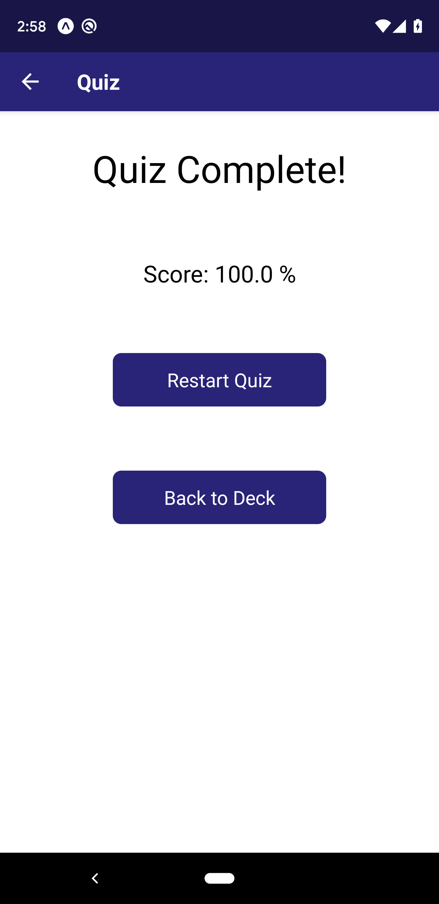

# QACards

The app allows users to study collections of flashcards. The app allows users to create different categories of flashcards called "decks", add flashcards to those decks, then take quizzes on the decks.

## Technology Used

This app is developed using `React`, `React-Native`, `Redux`, `Expo`, `JavaScript` and `JSX`.

## Run

To run the app:

* install all project dependencies with `npm install`
* start the development server with `expo start`

## API

The app uses `AsyncStorage` as the fake API.

## Platform Tested

The app has been throughly tested on two real Android devices running Android Version 10 (Pixel 3 XL) and Android Version 8.1.0 (Nexus 6P).

